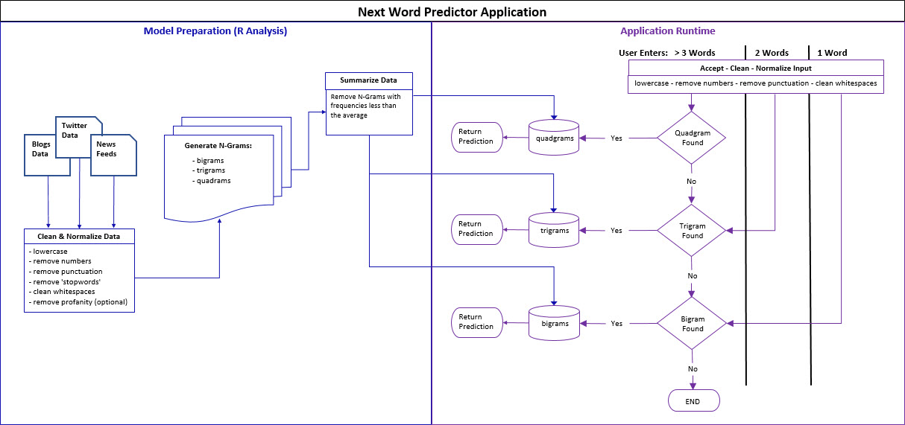

Coursera Data Science Capstone Project
========================================================
author: James H. Baxter
date: March 18, 2017
font-family: 'Calibri'

Objective
========================================================

The Coursera Data Science Specialization project assignment was to design an application that predicts the next word in a phrase/sentence. The result is the __Next Word Predictor__. This application can be very useful with a keyboard on a mobile device that helps a user type faster by anticipating what the next word would be. 

The following slides present details of the Next Word Predictor, including:

- Application Overview
- Application Design
- Additional Possibilities
- Conclusion and References  

Application Overivew
========================================================

The <a href="https://packetiq.shinyapps.io/nextwordpredictor" target="_blank">Next Word Predictor</a> application is simple to use: simply start typing words in the text field and up to 4 possible next words will automatically display below the field, as depicted in the screenshot below.  

Each predicted word can be clicked to add it to your phrase and predict the next word. Or, you can simply keep typing words. 

Application Design
========================================================
<small>The <a href="https://packetiq.shinyapps.io/nextwordpredictor" target="_blank">Next Word Predictor</a> application uses text from blogs, news articles, and twitter as sources for language pattern models. [N-Grams](https://en.wikipedia.org/wiki/N-gram), [Markov](https://en.wikipedia.org/wiki/Markov_model) and [Katz's back-off models](https://en.wikipedia.org/wiki/Katz%27s_back-off_model) are used to predict the next word. Textual data was batch-processed, and a sample set used to improve performance with some sacrifice in accuracy. __Next-word prediction times are 1-2 seconds.__  The architecture and logical operation of the application is depicted below:</small>

Additional Possibilities 
========================================================
This project applied a small selection of available approaches to natural language processing and predictive analytics applications. There are many possibilities for improvement including:  

- Use of speech tagging algorithms to better understand the context of the user's words  
- Combining additional and more diverse data sources  
- Parallel processing to increase computational capability and speed  
- Inserting a feedback loop into the model (e.g., learn from what predictions users accept)  

Conclusion and References
========================================================
This project and the Data Science course were excellent introductions to machine learning techniques and related foundational knowledge.  

I consider the completion of this course a license to learn!

This is a list of resources related to this project:

- <a href="https://packetiq.shinyapps.io/nextwordpredictor" target="_blank">Next Word Predictor application</a>
- <a href="https://github.com/packetiq/coursera-capstone" target="_blank">Github repository for the capstone project files</a>
- <a href="http://rpubs.com/packetiq/CapstoneMilestoneReport" target="_blank">Milestone report for the capstone project</a>
- <a href="http://www.jstatsoft.org/v25/i05/" target="_blank">Text Mining Infrastructure in R</a>
- <a href="https://rstudio-pubs-static.s3.amazonaws.com/31867_8236987cf0a8444e962ccd2aec46d9c3.html" target="_blank">Basic Text Mining in R</a>
- <a href="https://cran.r-project.org/web/packages/tm/tm.pdf" target="_blank">tm Package for R</a>

